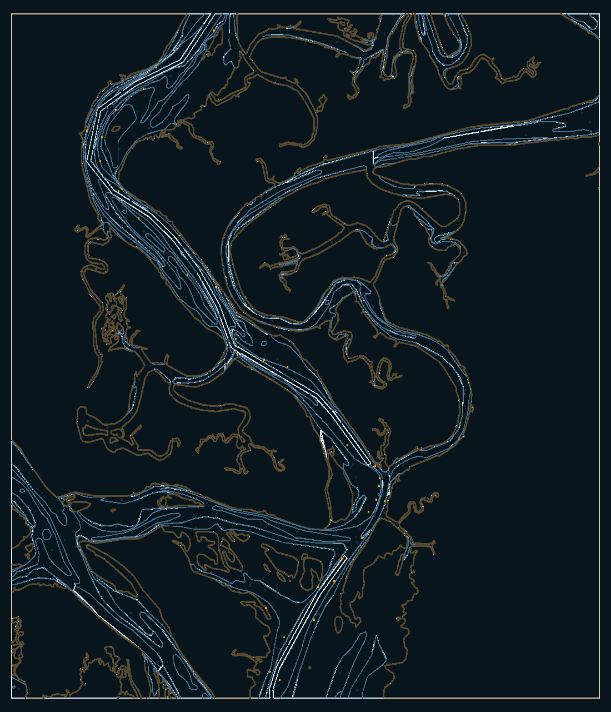

# RENDERMODEL-3 — real ENC cell through the WebGPU chart pipeline

## Why this exists

Before this task the entire chart render chain (RENDERMODEL → ARTIFACT → WEBGPU → QA) had
only ever been exercised on the synthetic **`chart-1`** fixture: a hand-authored 8×8 test
tile (`source_type: synthetic`, "intentionally tiny"). The browser WebGPU path (opt-in via
`?chartWebgpu=1`) literally drew that toy tile and nothing else. It had **never rendered a
real chart**, because the "stage 1" step that turns a real ENC cell into the neutral render
command stream did not exist anywhere in the repo (the S-52 presentation compiler is future
OpenCPN-branch work, and `helm-server` only rasterises ENC → PNG).

This task builds that missing stage 1 and proves the GPU path draws a **recognizable real
harbour**.

## The pipeline (what runs, and where)

```
ENC .000 (S-57)
   │  scripts/enc-to-render-fixture.py        ← NEW (this task); GDAL/OGR S-57, no s52plib
   ▼
scene.commands.json (+ source/provenance/manifest)   vulkan.render_scene.v0
   │  scripts/render-model-fixture-export     (existing, unchanged)
   ▼
render-model.json / .bin                              helm.render.model.v1
   │  scripts/render-artifact-compile         (existing, unchanged)
   ▼
render-artifact.json / .bin                           helm.render.artifact.v1  (WebGPU packet)
   │  copied to web/data/render-artifact-<cell>.json
   ▼
browser WebGPU layer (chart-artifact-webgpu.js)  +  S-52 atlas colours (chart-artifact-atlas.js)
```

`enc-to-render-fixture.py` reads a real cell with GDAL's S-57 driver (no OpenCPN / s52plib
engine required) and emits the neutral command stream the existing, already-working
downstream stages consume unchanged.

### Constraints it respects (discovered in the pipeline)

* **One material per command** (`material_id = "mat." + command_id`) and a fixed shader
  `materials` uniform of 32 → every visual category is a **single** `fill_area` command, so a
  whole cell uses **8 materials**.
* **Fan-only ring triangulation** (convex only) → the tool never hands raw ENC polygons to
  the compiler; it pre-expands every feature into **convex** primitives: line/boundary
  segments become thin quads, points become small squares.
* **Linear-in-lon/lat target mapping** (browser `tileToNdc`) → ENC lon/lat is projected into
  target pixels with the exact inverse, so the GPU path places geometry correctly over the
  basemap.
* **Compact packets** → coordinates are rounded to integers (the compiler serialises floats
  at precision 17) and geometry is Douglas–Peucker simplified (~1–2 px ≈ 4–8 m).

## The proof

`US5GA2BC` — Cumberland Sound / St. Marys River, GA (by Kings Bay): 188 depth areas, 179
depth contours, 130 coastline edges, 92 land areas, 250 soundings, 47 aids →
**12,831 convex primitives → 64,155 vertices, 8 materials**.



`preview.png` / the image above is produced by `scripts/render-artifact-preview.py`, a CPU
reference renderer that runs the **exact** WGSL projection math (`tileToNdc` web-mercator)
against the compiled artifact — i.e. what the WebGPU shader draws, without needing a
WebGPU-capable browser in CI.

## View it live (WebGPU-capable browser)

The app defaults to the synthetic `chart-1` fixture (keeps QA-1 / e2e goldens stable). To
draw the real cell:

* `?cell=us5ga2bc` in the URL, **or** `localStorage.helmChartCell = 'us5ga2bc'`

The map auto-fits to the cell's bounds. The renderer-status surface reports the active
renderer, fallback reason, and artifact schema/epoch as usual.

Harbour acceptance against live `:8080` (requires US5GA2BC loaded):

```bash
bash scripts/rendermodel-3-harbour-proof.sh
```

Evidence lands in `test-results/rendermodel-3-harbour/`.

## Rebuild

Requires GDAL (S-57 driver) on `PATH` and the ENC cell (e.g.
`~/.helm/runtime/enc/US5GA2BC/US5GA2BC.000`; NOAA public domain).

```bash
scripts/enc-to-render-fixture.py "$ENC" engine/captures/us5ga2bc \
    --cell-id US5GA2BC --pixel-size 2048 --simplify-px 2.0 --half-width-px 1.6
scripts/render-model-fixture-export engine/captures/us5ga2bc --print-hashes
scripts/render-artifact-compile     engine/captures/us5ga2bc --print-hashes
cp engine/captures/us5ga2bc/render-artifact.json \
   web/data/render-artifact-us5ga2bc.json
```

The large intermediates (`scene.commands.json`, `render-model.*`, `render-artifact.*`) are
rebuildable and git-ignored in the fixture dir; the committed runtime asset is
`web/data/render-artifact-us5ga2bc.json`.

## Honest limitations (scope for follow-ups)

* ~~Areas are drawn as **outlines** (convex quads), not filled polygons~~ — **landed in
  RENDERMODEL-4**: DEPARE/LNDARE/DRGARE are now earcut-triangulated **filled** polygons with
  the S-52 day palette (see `scripts/_earcut.py` and `web/test/rendermodel4-fill-parity.test.cjs`).
* Colours are approximate S-52 (a small repo-owned atlas), not full S-52 conditional
  symbology; text/soundings render as markers, not glyph labels (the base shader has no glyph
  atlas yet).
* One cell, one display-state capture; no quilting/SCAMIN. GDAL is a capture-time dependency
  (not a runtime one).
