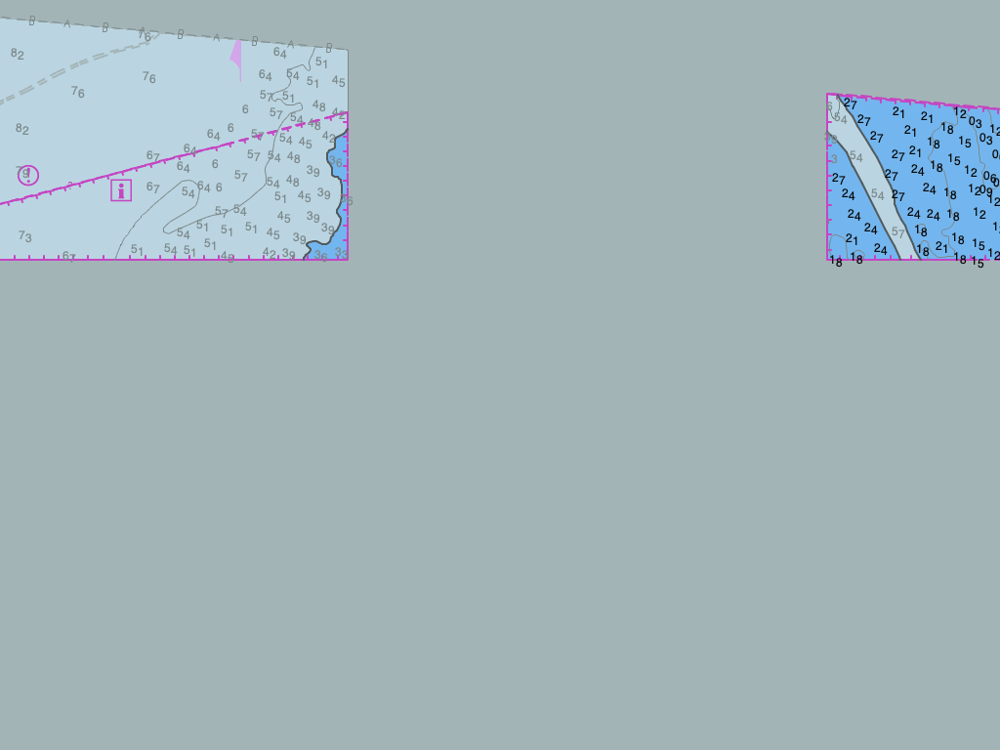

# Chart-render spike — OpenCPN's S-52 ENC renderer, headless ✅ PROVEN

The second load-bearing proof for [the plan](../../../docs/OPENCPN-REUSE.md): **OpenCPN's
`s57chart` renders a real ENC cell to a bitmap with NO GUI window and NO GL context**, so we can
serve true IHO S-52 charts as tiles to the Helm UI (Option A). Validated on macOS (Apple Silicon,
wx 3.2.10, 2026-06-23). This is the chart half; [`../`](../) is the nav-core half.

## Proof
`proof-US5FL96M.png` — 1024×768, rendered headless from NOAA cell **US5FL96M** (Key West):
S-52 soundings in the correct typography, blue depth-area shading + contours, the magenta
cell-boundary scale border with ticks, the "i" info symbol. Grey = the S-52 **NODTA** no-data
colour (correct, not a failure). Rebuild + cache-clear → **byte-identical** 54,176-byte PNG.



For the Vulkan renderer POC acceptance rubric, stakeholder evidence, and
explicit non-goals, see [POC-ACCEPTANCE.md](POC-ACCEPTANCE.md).

## What it does (`chart_spike.cpp`, ~240 lines)
Headless: `wxInitializer` + PNG handler → construct `s52plib` directly from `data/s57data`
(DAY scheme) → `s57RegistrarMgr` → `s57chart::Init(US5FL96M.000, FULL_INIT)` builds the SENC
in-process → `SetColorScheme` → a `ViewPort` fitted to the cell → `wxBitmap`+`wxMemoryDC` →
`RenderRegionViewOnDC` → save PNG. CoreGraphics-backed `wxMemoryDC` needs no display session.

## Build
The build is now reproducible from a pinned OpenCPN + maintained patch series —
see [`engine/VENDORING.md`](../../../engine/VENDORING.md). The `chart-spike` target
(added by `patches/0003`) compiles a hand-picked slice of `gui/src` + the overlay files,
linking `ocpn::s52plib ocpn::s57-charts ocpn::geoprim ocpn::iso8211 ssl::sha1`.
`chart_stubs.cpp` (the headless globals) lives in [`engine/vendor/cli/`](../../../engine/vendor/cli/);
`chart_typeinfo.cpp` is **retired** (the seam severs the plugin `dynamic_cast`, so no faked RTTI).
```bash
engine/bootstrap.sh                          # builds chart-spike (+ helm-tiles/helm-engine)
"$HELM_OCPN_DIR/build/cli/chart-spike" /tmp/ENC_ROOT/US5FL96M/US5FL96M.000 /tmp/helm_chart.png
```

## The hard-won gotchas (6 build passes + 2 runtime fixes)
These are the non-obvious things that make headless S-52 work — the spec missed them; the build/run revealed them:
1. **Keep `ocpnUSE_GL` ON — ABI lock-in.** The prebuilt `libS52PLIB.a` has GL-only member fields
   (`s52plib.h:384`); compiling the slice *without* GL corrupts its memory layout. Compile **with**
   GL and instead add three small TUs (`ocpn_pixel.cpp`, `shaders.cpp`, `ocpn_gl_options.cpp`) for
   `ocpnMemDC`/`ocpnBitmap`, shader globals, `g_GLOptions`; **stub the never-executed** GL symbols
   (`glChartCanvas::*`, `Quilt::GetChartAtPix`, `ChartCanvas::*`, `g_texture_rectangle_format`).
2. **The black-image bug.** For a single cell, `RenderRegionViewOnDC` ends with
   `pDIB->SelectIntoDC(dc)` — it selects *its* bitmap into the DC, it does **not** blit into your
   pre-made bitmap. Grab `dc.GetSelectedBitmap()` after render, not your original `bmp`.
3. **`m_pRegistrarMan` (global in `o_senc.cpp`) must be assigned** the constructed `s57RegistrarMgr*`
   — NULL → SIGSEGV in `Osenc::CreateSENCRecord200`→`getAttributeID` during SENC build.
4. **Define `OCPNPlatform` directly** (only 4 virtuals needed) instead of subclassing — avoids
   dragging the 2,333-line `ocpn_platform.cpp` and its ~20-gui-file dependency cascade.
5. **`typeinfo for ChartPlugInWrapper`** is the one symbol you can't satisfy by linking real code
   (its RTTI drags the BSB reader). `chart_typeinfo.cpp` (43 lines) emits just that ABI symbol via a
   same-named stand-in (never dereferenced at runtime). A `-Wl,-U` allow-undefined links but crashes
   at dyld load (flat namespace) — the stand-in is the correct fix.
6. **Drop `s57_ocpn_utils.cpp`** from the slice (dead file: redefines light-sector helpers
   `s57chart.cpp` already has) and **add `libs/ssl_sha1/include`** (`s57chart`→`ssl/sha1.h`).
   Remove 7 duplicate globals that live in the libs/model (`ps52plib`, `g_csv_locn`, `g_SENCPrefix`,
   `g_b_overzoom_x`, `g_b_EnableVBO`, `g_bportable`, `g_SencThreadManager`).

## One open item (didn't block rendering)
`GetNativeScale()` reads back as `1` (the DSPM:CSCL→SENC scale plumbing returns 1 for this cell).
For production, wire the true ~1:12,000 native scale so **SCAMIN** feature filtering and
safety-contour selection behave at varying zoom.

## Next (Phase 2)
This is the foundation for the **Helm Engine** chart-tile service: wrap this in
`render(ViewPort, scale, scheme) → bitmap` and serve `http://127.0.0.1/chart/{z}/{x}/{y}.png` as a
MapLibre raster source — true S-52 under the Helm UI.
